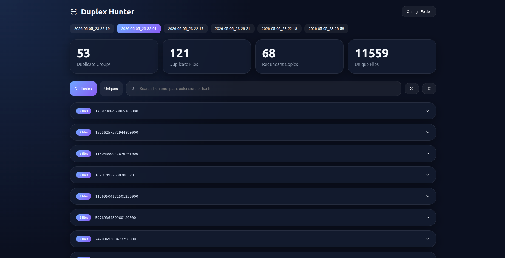

# Duplex-Hunter: Duplicate & Unique Scanner

Simple tool to recursively scan directories, hash files, and find duplicates.
Supports fast or full hashing and exports results to JSON.

## Examples Usage

### Find Duplicates

Scan one or more directories and identify duplicate files.

```bash
duplexhunter --path /home/user/photos --path /home/user/downloads --export-path /tmp/results
```

### Backup Integrity Check

Verify that all files from the source were copied correctly to the backup.
Full hashing is used by default to ensure byte-level accuracy — do not use `--enable-fast-hash` for this use case.

```bash
duplexhunter --path /home/user/documents --path /mnt/backup/documents --export-path /tmp/results
```

Any files appearing only in one of the two paths were either not backed up or have been modified.

## Limitations

File matching is based on [xxHash](https://xxhash.com/), an extremely fast non-cryptographic hash algorithm.
This means it is **not suitable for security-sensitive use cases** such as tamper detection.

For typical duplicate scanning workloads, the probability of a false collision is negligible —
XXH64 produces ~294 collisions across 100 billion hashes, which is consistent with the statistically
expected rate for an ideal 64-bit hash function. In practice, scanning even a very large file collection
of millions of files, the chance of a false match is astronomically small.

However, if absolute certainty is required, results should be verified manually.

## Build Instructions

```bash
git clone git@github.com:panosmouze/Duplex-Hunter.git
cd Duplex-Hunter
git submodule update --init --recursive
mkdir build && cd build
cmake ..
make
cmake --install . --prefix ../out
```

## Usage

```bash
duplexhunter [options]

--path <path>           Path to scan (can be repeated)
--depth <n>             Max recursion depth
--export-path <path>    Directory to save results
--enable-fast-hash      Use faster (partial) hashing
--help                  Show help
```

## Duplex-Hunter UI

A static HTML page to visualize the generated results.
Open `docs/duplex-hunter-ui.html` in your browser, load an export file and view a summary.


