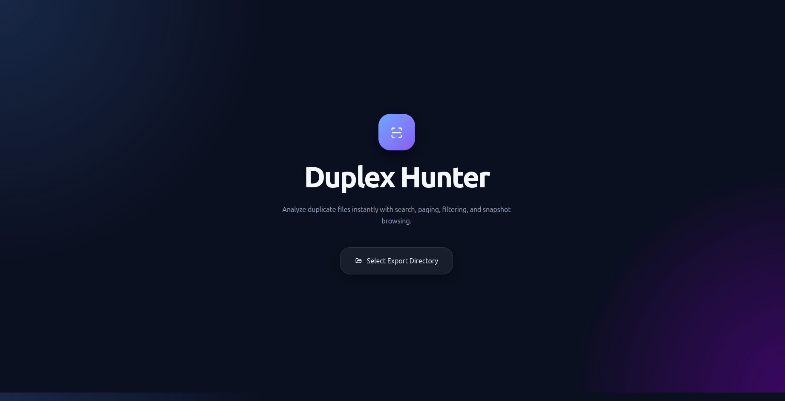
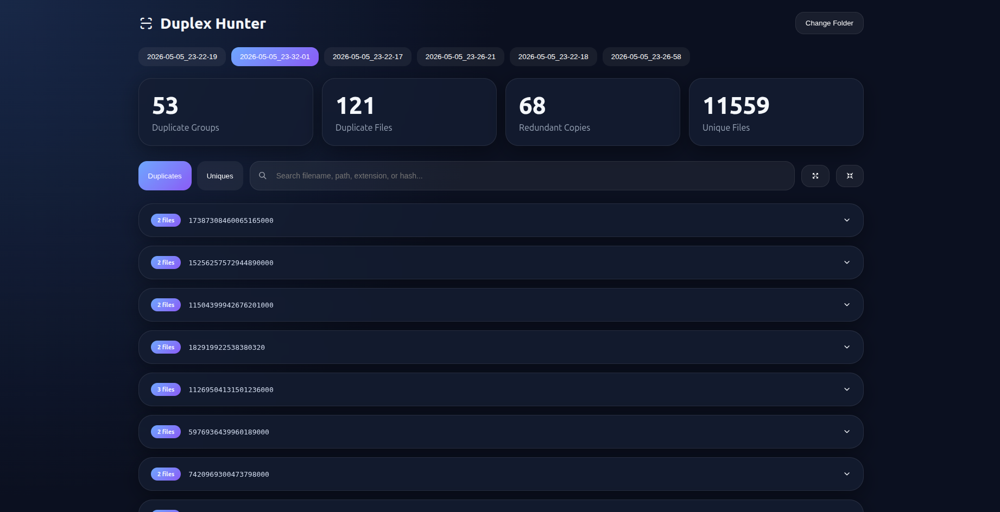

# Duplex-Hunter: Duplicate & Unique Scanner

Simple tool to recursively scan directories, hash files, and find duplicates.
Supports fast or full hashing and exports results to JSON.

## Examples

### Find Duplicates

Scan one or more directories and identify duplicate files.

```bash
duplexhunter-cli --path /home/user/photos --path /home/user/downloads --export-path /tmp/results
```

### Backup Integrity Check

Verify that all files from the source were copied correctly to the backup.
Full hashing is used by default to ensure byte-level accuracy — do not use `--enable-fast-hash` for this use case.

```bash
duplexhunter-cli --path /home/user/documents --path /mnt/backup/documents --export-path /tmp/results
```

Any files appearing only in one of the two paths were either not backed up or have been modified.

## Limitations

File matching is based on [xxHash](https://xxhash.com/), an extremely fast non-cryptographic hash algorithm.
This means it is **not suitable for security-sensitive use cases** such as tamper detection.

For typical duplicate scanning workloads, the probability of a false collision is negligible —
XXH64 produces ~294 collisions across 100 billion hashes, which is consistent with the statistically
expected rate for an ideal 64-bit hash function. In practice, scanning even a very large file collection
of millions of files, the chance of a false match is astronomically small.

However, if absolute certainty is required, results should be verified manually.

## Build Process

### Prerequisites

- [xxHash](https://github.com/Cyan4973/xxHash) library
- [libmagic](https://www.darwinsys.com/file/) (file type detection)
- [FFmpeg](https://ffmpeg.org/) libraries (`libavformat`, `libavcodec`, `libavutil`, `libswscale`, `libswresample`), optional:
  media analysis is disabled if they are missing or with `-DDUPLEXHUNTER_WITH_FFMPEG=OFF`
- [libcurl](https://curl.se/libcurl/) and [libzip](https://libzip.org/), optional:
  `--upload-url` is disabled if they are missing or with `-DDUPLEXHUNTER_WITH_UPLOAD=OFF`

### Instructions

```bash
git clone git@github.com:panosmouze/Duplex-Hunter.git
cd Duplex-Hunter
git submodule update --init --recursive
mkdir build && cd build
cmake ..
make
cmake --install . --prefix ../out
```

## Usage

```bash
duplexhunter [options]

--path <path>           Path to scan (can be repeated)
--depth <n>             Max recursion depth (default UINT16_MAX)
--export-path <path>    Directory to save results (default .)
--enable-fast-hash      Use faster (partial) hashing (default false)
--analyze[=<level>]     Gather per-file stats based on the file type: basic (default), packets or deep
--upload-url <url>      Zip the results and upload them to the self-hosted web UI
--help                  Show help
```

## File Analysis

With `--analyze`, an `analysis.json` file is exported alongside the results.
Content is analyzed once per duplicate group, while filesystem stats are collected for every file.
Each level includes everything from the levels above it.

### `--analyze` or `--analyze=basic`

Reads headers and metadata only, taking milliseconds per file.

- **All files**: MIME type and description (libmagic), extension/content mismatch, byte entropy
  (sampled; ~8 bits/byte indicates compressed or encrypted data), permissions, owner, timestamps,
  hard links, sparseness, extended attributes.
- **Video / audio / images** (FFmpeg): container, duration, bitrate, tags, chapters and per-stream
  codec, profile, resolution, frame rate, pixel format, bit depth, HDR, rotation, sample rate,
  channels, lossless/lossy, forced and hearing impaired subtitle streams. Images also report
  EXIF/embedded metadata, GPS presence and a perceptual hash (dHash).
- **External subtitles**: subtitle files stored with each video copy (`.srt`, `.ass`, `.ssa`, `.vtt`,
  `.sub`/`.idx`, `.sup`), with the language and forced/SDH flags read from their names. Subtitle files
  also point back to their video, so it is visible which copy of a duplicate video has subtitles.
  Recognized layouts:
  - `Movie.srt`, `Movie.en.srt`, `Movie.el.forced.srt`, `Movie.en.sdh.srt` next to `Movie.mkv`
  - `Subs/2_English.srt` next to the only video of a folder
  - `Subs/Episode/2_English.srt` for `Episode.mkv`

### `--analyze=packets`

Reads every packet of media files without decoding them, which costs about as much as hashing them.
Entropy is calculated over the whole file.

- integrity check: truncation and silently skipped damage (frames and duration compared with the
  container), corrupt packets, timestamp gaps and non-monotonic timestamps
- per stream: measured and peak bitrate, constant/variable bitrate, keyframe interval,
  average frame rate, constant/variable frame rate, audio/video start offset
- frame count of animated images
- external subtitles: text encoding, number of lines and timing, with a warning when a file is not
  UTF-8 or does not fit the length of its video
- perceptual hashes at 10/30/50/70/90% of a video, decoding only from the nearest keyframe

### `--analyze=deep`

Decodes media files completely, which is considerably slower.

- decode errors and corrupt frames, which catch damage inside packets
- black frame ratio
- audio peak and RMS level, clipped samples, leading and trailing silence

Perceptual hashes of similar images or videos differ in only a few bits, so they can be used to
find near-duplicates such as resized or re-encoded copies.

## Duplex-Hunter UI

A static HTML page to visualize the generated results.
Open `docs/duplex-hunter-ui.html` in your browser, load an export file and view a summary.



### Self-hosted Web UI (Docker)

The same page can be served by a small backend that keeps results in MongoDB, so they can be
browsed anytime without selecting a folder.

```bash
cd webui
docker compose up -d --build
```

| Service       | URL                          | Purpose                                 |
|---------------|------------------------------|-----------------------------------------|
| UI            | http://localhost:8080        | Upload and browse results               |
| Swagger       | http://localhost:8080/docs   | API endpoints (`/redoc` also available) |
| mongo-express | http://localhost:8081        | Inspect the database                    |

Results can be uploaded by the CLI right after a scan:

```bash
duplexhunter-cli --path /home/user/photos --export-path /tmp/results --upload-url http://homelab:8080
```

The export folder is zipped as `<timestamp>.zip` next to it and uploaded, and the zip is kept, so a
failed upload can be repeated from the UI. Either the base URL of the UI or the full upload endpoint
(`http://homelab:8080/api/results`) can be given.

Exports can also be uploaded from the UI, zipped with their timestamp as the name, e.g.
`cd /tmp/results && zip -r 2026-10-04_13-07-17.zip 2026-10-04_13-07-17`.
The timestamp identifies the result, and uploading the same name again asks before replacing it.
Groups of a stored result can be annotated: expand a group to add a comment or assign labels.
Labels are managed from the **Labels** dialog and every group starts without any. The toolbar
filters a result by label or comment, and the **Notes** page lists the commented or labeled groups
of all results, which open the result at that group when clicked.

Ports can be changed with `UI_PORT` and `MONGO_EXPRESS_PORT`. There is no authentication,
so only run it on a trusted network.
